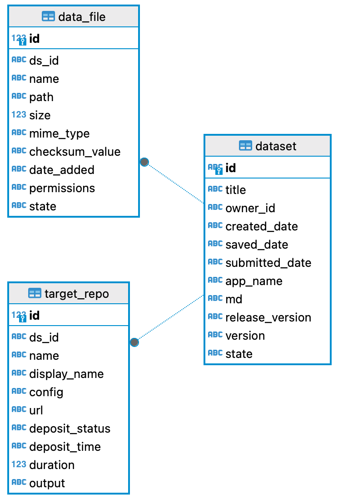

# Automated Curation Platform (ACP)
At DANS, we have developed the Automated Curation Platform (ACP) — a comprehensive service that generates curated deposit packages tailored to user specifications. Each package comprises metadata, files, and repository-specific configurations, carefully customized to meet the precise requirements of the designated repository target.

The ACP was designed to streamline and automate the entire process of deposit package creation, addressing the unique needs of diverse repositories by organizing, filtering, and selecting data accordingly. Leveraging advanced algorithms, machine learning techniques, and predefined rule sets, ACP performs complex curation tasks autonomously, greatly reducing or even eliminating the need for manual input. These automated tasks encompass data gathering, tagging, sorting, and content analysis, which collectively improve efficiency and accuracy.

The ACP core function is to “curate” content by identifying high-quality, relevant items, filtering out unnecessary or low-value data, and arranging information in ways that align with the platform's overall objectives. By integrating critical elements like user input, repository configurations, bridge modules, and transformers, ACP seamlessly streamlines the process of curation content to satisfy the specific requirements of each repository target, ensuring a consistent and user-friendly experience.

The curation process is dynamically adapted to each repository target as specified by the user. ACP automatically retrieves configuration details from the repository assistant service, based on the provided configuration name. This configuration is essential, containing details like the repository URL, bridge module, and transformers, all of which empower ACP to seamlessly accommodate varying repository standards.

Repository URL: This URL acts as a direct link to the designated storage location within the repository, enabling seamless data exchange and interaction.

Bridge Module: Serving as a pivotal component, the bridge module is responsible for structuring the deposit package in the desired target format (e.g., SWORD). This module is adaptable, ensuring that curated content adheres to the specific formatting requirements of each chosen repository.

Transformers: These components play a vital role in translating metadata to fit the standards of the destination repository, guaranteeing that deposited content is both accurately packaged and fully compliant with the repository’s metadata standards.

By centralizing and automating these crucial components, ACP provides an efficient, scalable, and adaptable solution for deposit package generation. This design makes it significantly easier for users to manage, curate, and deliver content that meets precise repository standards, promoting streamlined workflows and enhancing the quality of digital content management.

 ## Database Schema

    