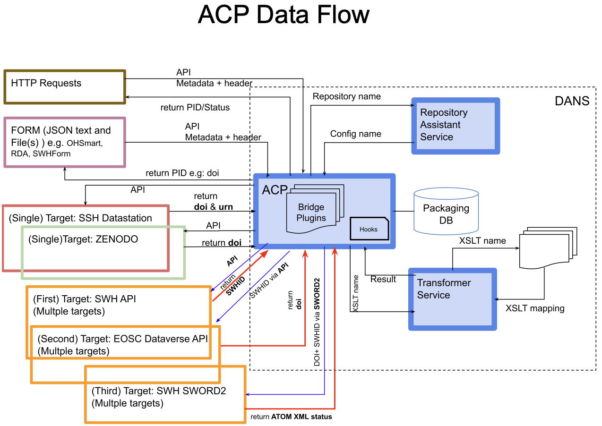
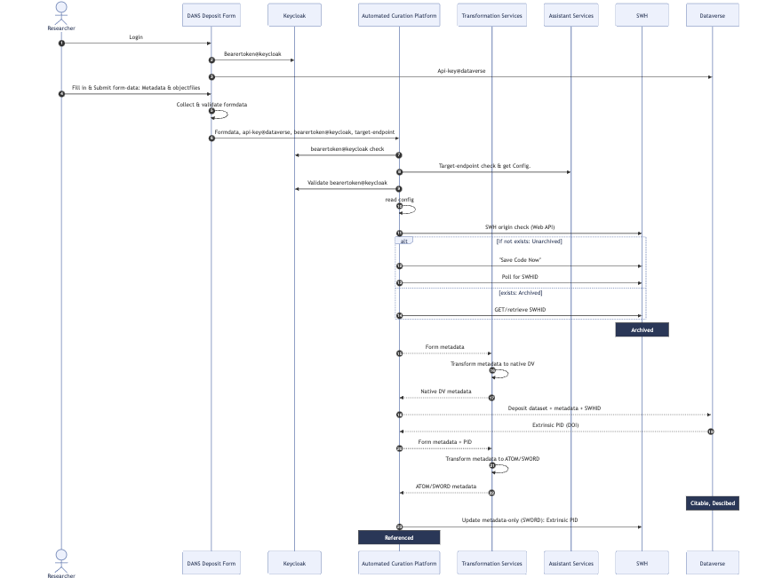

# Automated Curation Platform (ACP)
At DANS, we have developed the Automated Curation Platform (ACP) — a comprehensive service that generates curated deposit packages tailored to user specifications. Each package comprises metadata, files, and repository-specific configurations, carefully customized to meet the precise requirements of the designated repository target.

The [ACP](https://automated-curation-platform-acp.readthedocs.io/en/latest/source/src.html) was designed to streamline and automate the entire process of deposit package creation, addressing the unique needs of diverse repositories by organizing, filtering, and selecting data accordingly. Leveraging advanced algorithms, machine learning techniques, and predefined rule sets, ACP performs complex curation tasks autonomously, greatly reducing or even eliminating the need for manual input. These automated tasks encompass data gathering, tagging, sorting, and content analysis, which collectively improve efficiency and accuracy.

The [ACP](https://automated-curation-platform-acp.readthedocs.io/en/latest/source/src.html)core function is to “curate” content by identifying high-quality, relevant items, filtering out unnecessary or low-value data, and arranging information in ways that align with the platform's overall objectives. By integrating critical elements like user input, repository configurations, bridge modules, and transformers, ACP seamlessly streamlines the process of curation content to satisfy the specific requirements of each repository target, ensuring a consistent and user-friendly experience.



The curation process is dynamically adapted to each repository target as specified by the user. ACP automatically retrieves configuration details from the [repository assistant service](https://github.com/ekoi/repository-assistant-service), based on the provided configuration name. This configuration is essential, containing details like the repository URL, bridge module, and transformers, all of which empower ACP to seamlessly accommodate varying repository standards.
Repository URL: This URL acts as a direct link to the designated storage location within the repository, enabling seamless data exchange and interaction.

Bridge Module: Serving as a pivotal component, the bridge module is responsible for structuring the deposit package in the desired target format (e.g., SWORD). This module is adaptable, ensuring that curated content adheres to the specific formatting requirements of each chosen repository.

Transformers: These components play a vital role in translating metadata to fit the standards of the destination repository, guaranteeing that deposited content is both accurately packaged and fully compliant with the repository’s metadata standards. More details can be found in the [transformer service](https://github.com/ekoi/dans-transformer-service).

By centralizing and automating these crucial components, ACP provides an efficient, scalable, and adaptable solution for deposit package generation. This design makes it significantly easier for users to manage, curate, and deliver content that meets precise repository standards, promoting streamlined workflows and enhancing the quality of digital content management.

## Integrating OpenTelemetry Protocol (OTLP) in ACP
To enhance observability and monitoring within ACP, DANS integrates the OpenTelemetry Protocol (OTLP), a telemetry data protocol optimized for collecting and transmitting metrics, logs, and traces. OTLP brings several key benefits to ACP:

- **Unified Observability**: OTLP simplifies tracking and monitoring by aggregating data across various services, providing a comprehensive view of the platform’s performance and behavior.
- **Scalability**: The protocol efficiently handles large volumes of telemetry data, ensuring ACP can scale effectively as demand grows.
- **Enhanced Insights**: OTLP enables detailed performance analysis, empowering ACP to identify and optimize areas within the automated curation process, ultimately improving the efficiency and accuracy of curated deposit packages.

## Implementing TUS Protocol in ACP
ACP also utilizes the TUS Protocol, an open protocol designed for reliable, resumable file uploads. This protocol offers several significant benefits to ACP:

- **Resumable Uploads**: TUS supports resumable uploads, allowing large files to be uploaded in segments and resuming from where they left off in case of interruptions. This is particularly beneficial for handling large datasets or multimedia files in ACP.
- **Reliability**: TUS reduces the risk of upload failures, ensuring data integrity and consistency by allowing for seamless recovery from connectivity issues.
- **Scalability**: The protocol efficiently manages high-volume and high-frequency file uploads, allowing ACP to handle diverse and large datasets across multiple repositories with ease.
- **Improved User Experience**: By reducing upload failures and ensuring smoother file transfers, TUS enhances the user experience, making ACP more dependable for users needing to transfer substantial files reliably.

## Implementations of the Automated Curation Platform (ACP)

At DANS, we have developed several implementations of the Automated Curation Platform (ACP) to cater to different curation needs and repository targets:

- **Single Target Implementations**: These instances of ACP are designed to curate and deposit content to a specific repository target.
  - [OH-SMART](https://ohsmart.datastations.nl/). Target repository: [DANS SSH Datastations](https://ssh.datastations.nl/)
  - [RDA](https://rda.dansdemo.nl/). Target repository: [Zenodo](https://zenodo.org/)

- **Multiple Target Implementation**: This version of ACP supports curation and deposition to multiple repository targets, providing greater flexibility and scalability.
  - [Software Heritage](https://swh.dansdemo.nl/). Targets: [Software Heritage - API & SWORD2](https://www.softwareheritage.org/) and [Dataverse](https://dataverse.eosc.dansdemo.nl/dataverse/eosc) 
    
- **Rule-Engines Pre-Processing**: This implementation leverages rule engines for pre-processing data, ensuring that the content meets specific criteria before curation and deposition.
  - [4TU.ResearchData](https://4tu.dansdemo.nl/)

By offering these diverse implementations, DANS ensures that the ACP can meet a wide range of curation requirements, enhancing the efficiency and accuracy of digital content management across various repositories.
 ## Database Schema
The database schema for the Automated Curation Platform (ACP) is designed to support the curation process by storing essential information related to the curation tasks, configurations, and repository targets. This schema is crucial for managing and organizing data effectively, ensuring that the curation process runs smoothly and efficiently.

**By default, after every successful ingestion to the target repository, the metadata and files will be deleted from the database and the file system**. However, it is possible to configure the system to retain the **metadata** for a specific period for auditing purposes.

## How to Run in docker-compose
To run the Automated Curation Platform (ACP) using `docker-compose`, follow these steps:

1. **Clone `docker-compose` from [acp-ras-transformer](https://github.com/koharudin/acp-ras-transformer)**:
    
2. **Run `git submodule update --remote`**

3. **Run `docker-compose`**:
    ```sh
    docker-compose up -d
    ```

4. **Access the ACP**:
    Open your browser and navigate to `http://localhost:10124/docs` or `http://localhost:10124/redoc`.

This setup will start the ACP, RA Service, and Transformer Service, allowing you to begin using the Automated Curation Platform for your curation needs.