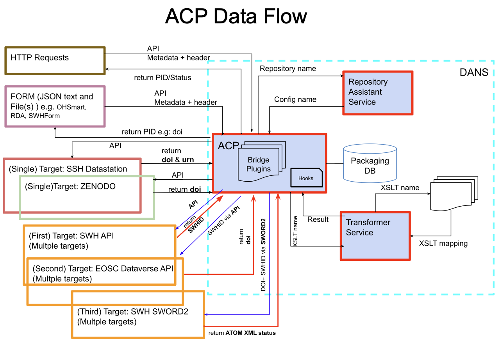

# Automated Curation Platform (ACP)
At DANS, we have developed the Automated Curation Platform (ACP) — a comprehensive service that generates curated deposit packages tailored to user specifications. Each package comprises metadata, files, and repository-specific configurations, carefully customized to meet the precise requirements of the designated repository target.


The [ACP](https://automated-curation-platform-acp.readthedocs.io/en/latest/source/src.html) was designed to streamline and automate the entire process of deposit package creation, addressing the unique needs of diverse repositories by organizing, filtering, and selecting data accordingly. ACP is flexible, allowing you to harvest or collect data from any source and deposit it into any repository. Leveraging advanced algorithms, machine learning techniques, and predefined rule sets, ACP performs complex curation tasks autonomously, greatly reducing or even eliminating the need for manual input. These automated tasks encompass data gathering, tagging, sorting, and content analysis, which collectively improve efficiency and accuracy.

The [ACP](https://automated-curation-platform-acp.readthedocs.io/en/latest/source/src.html) core function is to “curate” content by identifying high-quality, relevant items, filtering out unnecessary or low-value data, and arranging information in ways that align with the platform's overall objectives. By integrating critical elements like user input, repository configurations, bridge plugins, and transformers, ACP seamlessly streamlines the process of curation content to satisfy the specific requirements of each repository target, ensuring a consistent and user-friendly experience. 



The curation process is dynamically adapted to each repository target as specified by the user. ACP automatically retrieves configuration details from the [repository assistant service](https://github.com/ekoi/repository-assistant-service), based on the provided configuration name. This configuration is essential, containing details like the repository URL, bridge plugin, transformers, file converter, enrichment and other services, all of which empower ACP to seamlessly accommodate varying repository standards.

**Repository URL**: This URL serves as a direct link to the designated storage location (the repository's API endpoint), facilitating seamless data exchange and interaction.

**Bridge Plugins**: Serving as a pivotal component, the bridge plugin is responsible for structuring the deposit package in the desired target format (e.g., SWORD). This plugin is adaptable, ensuring that curated content adheres to the specific formatting requirements of each chosen repository. The following Bridge Plugins are available in ACP:
- Zenodo
- Dataverse
- SWH API
- SWH Sword2
- Deposit to S3
- Deposit to File System

**Transformers**: These components play a vital role in translating metadata to fit the standards of the destination repository, guaranteeing that deposited content is both accurately packaged and fully compliant with the repository’s metadata standards. More details can be found in the [transformer service](https://github.com/ekoi/dans-transformer-service).

**Hooks (Alternative to Transformers)**: Hooks offer a more flexible and programmatic way to define transformations. Using hooks, you can:
- Implement alternative XSLT transformations using Python code.
- Use jmespath to define JSON-based transformations dynamically.

Hooks allow for advanced customization and extend the functionality of ACP by enabling users to create tailored transformation logic for complex repository requirements.

Hooks are ideal in scenarios where:
- Standard Transformers cannot meet the repository's specific requirements.
- Custom logic is needed to handle unique data formats, structures, or validations.
- JSON-based metadata manipulation is required.
- Alternative XSLT stylesheets are necessary for metadata transformation.

By centralizing and automating these crucial components, ACP provides an efficient, scalable, and adaptable solution for deposit package generation. This design makes it significantly easier for users to manage, curate, and deliver content that meets precise repository standards, promoting streamlined workflows and enhancing the quality of digital content management.

## Integrating [OpenTelemetry](https://opentelemetry.io/docs/what-is-opentelemetry/) Protocol (OTLP) in ACP
To enhance observability and monitoring within ACP, DANS integrates the OpenTelemetry Protocol (OTLP), a telemetry data protocol optimized for collecting and transmitting metrics, logs, and traces. OTLP brings several key benefits to ACP:

- **Unified Observability**: OTLP simplifies tracking and monitoring by aggregating data across various services, providing a comprehensive view of the platform’s performance and behavior.
- **Scalability**: The protocol efficiently handles large volumes of telemetry data, ensuring ACP can scale effectively as demand grows.
- **Enhanced Insights**: OTLP enables detailed performance analysis, empowering ACP to identify and optimize areas within the automated curation process, ultimately improving the efficiency and accuracy of curated deposit packages.

Currently, ACP uses the [Jaeger](https://www.jaegertracing.io/) backend for tracing and monitoring, leveraging the OTLP protocol to collect and transmit telemetry data effectively. This integration enhances the platform’s observability, enabling users to gain valuable insights into the curation process and repository interactions.
In our demo environment, the jaeger backend can be accessed at `https://meltservice.labs.dansdemo.nl`. Choose the service name `Automated Curation Platform` and the desired lookback to view the traces.

The following image shows the Jaeger UI for the Automated Curation Platform for the last 5 minutes for all operations.:


## Implementing [TUS Protocol](https://tus.io/) in ACP
ACP also utilizes the TUS Protocol, an open protocol designed for reliable, resumable file uploads. This protocol offers several significant benefits to ACP:

- **Resumable Uploads**: TUS supports resumable uploads, allowing large files to be uploaded in segments and resuming from where they left off in case of interruptions. This is particularly beneficial for handling large datasets or multimedia files in ACP.
- **Reliability**: TUS reduces the risk of upload failures, ensuring data integrity and consistency by allowing for seamless recovery from connectivity issues.
- **Scalability**: The protocol efficiently manages high-volume and high-frequency file uploads, allowing ACP to handle diverse and large datasets across multiple repositories with ease.
- **Improved User Experience**: By reducing upload failures and ensuring smoother file transfers, TUS enhances the user experience, making ACP more dependable for users needing to transfer substantial files reliably.

The following image shows the TUS protocol in action, allowing users to upload large files (tested up to 400Gb) seamlessly and efficiently:


## Authentication Support

ACP currently supports the following authentication mechanisms:

- **OAuth2PasswordBearer**: This method leverages OAuth 2.0's password bearer token flow for secure authentication.  
- **[Keycloak](https://www.keycloak.org)**: ACP integrates with Keycloak for robust and centralized identity and access management, allowing users to authenticate and manage permissions seamlessly.

These options ensure secure and scalable access to the platform, meeting the authentication requirements of modern systems.

## [ACP UI Admin](https://github.com/koharudin/acp-admin)

The ACP comes equipped with an intuitive **UI Admin** interface, providing administrators and users with robust tools to manage, monitor, and fine-tune the platform. Key features include:

1. **Monitoring the Progress of the Pipeline Flow**
   - Administrators can visually track the progression of curation pipelines in real-time, ensuring transparency in every step of the process.
   - Detailed views highlight the status and performance metrics of ongoing flows.

2. **Checking the Status of Each Flow**
   - The UI provides granular insights into the state of individual curation flows, enabling administrators to quickly identify bottlenecks or errors.
   - Logs and reports are accessible for troubleshooting and auditing.

3. **Managing Repository Assistant Service**
   - Easily create, modify, and delete repository targets to accommodate evolving requirements.
   - Fine-tune configurations for repository URLs and associated plugins directly from the UI.

4. **Managing Transformer Service**
   - Configure and maintain transformers that translate metadata formats to meet the standards of target repositories.
   - Add, update, or deactivate transformers based on specific repository needs.

5. **Managing Bridge Plugins**
   - Customize and maintain bridge plugins that structure deposit packages in the required formats (e.g., SWORD).
   - Test and validate plugins to ensure proper alignment with repository requirements.

6. **Managing the Curation Process**
   - Oversee and control the entire curation workflow, from initial data ingestion to final deposit package generation.
   - Adjust rules, algorithms, or user-defined inputs to improve curation accuracy and relevance.
   - Schedule or automate specific processes to optimize resource utilization.

The ACP UI Admin consolidates these features into a centralized dashboard, empowering users to efficiently manage the platform's operations and ensuring seamless alignment with repository standards.


## Implementations of the Automated Curation Platform (ACP)

At DANS, we have developed several implementations of the Automated Curation Platform (ACP) to cater to different curation needs and repository targets:

- **Single Target Implementations**: These instances of ACP are designed to curate and deposit content to a specific repository target.
  - [OH-SMART](https://ohsmart.datastations.nl/). Target repository: [DANS SSH Datastations](https://ssh.datastations.nl/)
  - [RDA](https://rda.dansdemo.nl/). Target repository: [Zenodo](https://zenodo.org/)

- **Multiple Target Implementation**: The ACP supports curation and deposition to multiple repository targets, providing greater flexibility and scalability.
  - [Software Heritage](https://swh.dansdemo.nl/). Targets: [Software Heritage - API & SWORD2](https://www.softwareheritage.org/) and [Dataverse](https://dataverse.eosc.dansdemo.nl/dataverse/eosc) 
    
  - 
- **Rule-Engines Pre-Processing**: This implementation leverages rule engines for pre-processing data, ensuring that the content meets specific criteria before curation and deposition.
  - [4TU.ResearchData](https://4tu.dansdemo.nl/)

By offering these diverse implementations, DANS ensures that the ACP can meet a wide range of curation requirements, enhancing the efficiency and accuracy of digital content management across various repositories.
 ## Database Schema
The database schema for the Automated Curation Platform (ACP) is designed to support the curation process by storing essential information related to the curation tasks, configurations, and repository targets. This schema is crucial for managing and organizing data effectively, ensuring that the curation process runs smoothly and efficiently.

**By default, after every successful ingestion to the target repository, the metadata and files will be deleted from the database and the file system**. However, it is possible to configure the system to retain the **metadata** for a specific period for auditing purposes.

## Integration with [Kestra](https://kestra.io/)

Kesra, a powerful open-source platform for data orchestration and scheduling, will soon be available for use within ACP. This integration will enhance ACP by enabling more efficient, flexible, and streamlined workflow automation for creating and delivering deposit packages.

## How to Run in docker-compose
To run the Automated Curation Platform (ACP) using `docker-compose`, follow these steps:

1. **Clone `docker-compose` from [acp-ras-transformer](https://github.com/koharudin/acp-ras-transformer)**:
    
2. **Run `git subplugin update --remote`**

3. **Run `docker-compose`**:
    ```sh
    docker-compose up -d
    ```

4. **Access the ACP**:
    Open your browser and navigate to `http://localhost:10124/docs` or `http://localhost:10124/redoc`.

This setup will start the ACP, RA Service, and Transformer Service, allowing you to begin using the Automated Curation Platform for your curation needs.

## Demo 1: Ingest XML Metadata to Dataverse and Zenodo
In this demo, we will showcase how the Automated Curation Platform (ACP) can ingest XML metadata to Dataverse and Zenodo repositories. The ACP automates the curation process, ensuring that the metadata is correctly formatted and deposited to the respective repositories.

### Steps:
1. **Get your Dataverse and Zenodo API_KEY**
2. **Edit the following json, save it (e.g.: targets-creds.json)**: 
    ```json
    [
      {
        "target-repo-name":"dataverse.eosc.dansdemo.nl",
        "credentials":{"username":"API_KEY","password":"YOUR_DATAVERSE_API_KEY"}
      },
      {
        "target-repo-name":"zenodo",
        "credentials":{"username":"API_KEY","password":"YOUR_ZENODO_API_KEY"}}]
    ```
3. **Run the following command, to check whether all services running**:
    ```sh
        check_services.sh
    ```
4. **Run the following command, to start the curation process**:
    ```sh
        start_curation.sh --acp_token=<acp_authorization_token> --user=<user_id> --data=./resources/examples/data/source_oai-cid.xml --ras_name=demo-cid-to-dv-zenodo --target_creds=targets-creds.json --content-type="application/xml"

    ```
5. **Check the status of the curation process**:
    ```sh
        check_curation.sh --acp_token=<acp_authorization_token> --user=<user_id> --ras_name=demo-cid-to-dv-zenodo
    ```